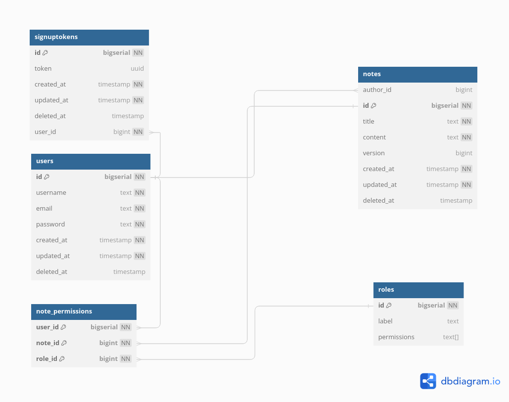

# Notes App

> This document outlines the process making a note taking app to sastify below user stories.


## Requirements
- Document (following template) → required to estimate tasks.
- Write unit tests for both FE & BE.
- Actively discuss requirements, technical issues, and documentation writing via meeting/Skype/call.
- Report: Daily progress report in daily standup (10:30 AM), demo work at the end of each week.

## User Stories

> See [docs/requirement.md](./docs/requirement.md)


## Build & Deploy Guide

> See [docs/contribute.md](./docs/contribute.md)


## Architecture

### Tech Stack
- **FE:** ReactJS / TypeScript / react-router-dom / @tanstack/react-query / tailwindcss / @testing-library/react / React Hooks Form / Shacdn UI
- **BE:** Django Rest Framework (Django 5.0)
- **DB:** Postgres 16
- **Deployment**: Docker/Caddy

### Technical Details

**Backend**

- Python 3.11.8
- Django 5.0 with Django rest framework 3.15.2
- Postgres 16
- JWT authentication with djangorestframework-simplejwt
- CORS protection with django-cors-headers
- Argon2 password hashing 
- HTTPS for transmiting with Caddy 2

**Frontend**

- ReactJS for UI
- Tailwindcss/ShadcUI for styling
- React-hook-form for form handling
- React-Query form manage async state
- Axios for http client


### Database schema

[Dbdiagram Link](https://dbdiagram.io/d/Notedb-66b59a618b4bb5230ea67131)

**Preview**




### Deployment note

```
Client Request
                 │
                 ▼
    ┌────────────────────────┐
    │        Caddy           │
    └────────────────────────┘
                 │
                 ▼
        Is path api/*?
        │            │
     No │            │ Yes
        │            │
        ▼            ▼
┌──────────────┐ ┌──────────────┐
│ Serve        │ │ Forward to   │
│ index.html   │ │ Django       │
│ (React App)  │ │ Backend      │
└──────────────┘ └──────────────┘
```

### Backend API Specifications (Django)

| HTTP Method | API Path | Description |
|-------------|----------|-------------|
| GET | /api/v1/notes/ | List all notes |
| POST | /api/v1/notes/ | Create a new note |
| GET | /api/v1/notes/{id}/ | Retrieve a specific note |
| PUT | /api/v1/notes/{id}/ | Update a specific note |
| PATCH | /api/v1/notes/{id}/ | Partially update a specific note |
| DELETE | /api/v1/notes/{id}/ | Delete a specific note |
| POST | /api/v1/notes/assign-permission/ | Assign permission to a note |
| DELETE | /api/v1/notes/assign-permission/ | Remove permission from a note |
| GET | /api/v1/notes/health-check/ | Check the health status of the API |
| GET | /api/v1/notes/shared/ | Retrieve shared notes |
| POST | /api/v1/users/login/ | User login to obtain access and refresh tokens |
| GET | /api/v1/users/me/ | Retrieve current user's profile |
| POST | /api/v1/users/refresh/ | Refresh the access token |
| GET | /api/v1/users/roles/ | List all user roles |
| POST | /api/v1/users/roles/ | Create a new user role |
| GET | /api/v1/users/roles/{id}/ | Retrieve a specific user role |
| PUT | /api/v1/users/roles/{id}/ | Update a specific user role |
| PATCH | /api/v1/users/roles/{id}/ | Partially update a specific user role |
| DELETE | /api/v1/users/roles/{id}/ | Delete a specific user role |
| GET | /api/v1/users/search/ | Search for users by username |
| POST | /api/v1/users/sign-up/ | Register a new user |
| GET | /api/v1/users/verify/{token}/ | Verify a user's account |

### Frontend screens


| File Name | Description |
|-----------|-------------|
| AssignPermission.tsx | Component for assigning permissions |
| CheckEmail.tsx | Component for email verification process |
| EmailVerified.tsx | Component to display email verification status |
| Home.tsx | Home page component |
| Login.tsx | User login component |
| Logout.tsx | User logout component |
| NotFound.tsx | 404 Not Found page component |
| Shared.tsx | Component for shared content or functionality |
| SignUp.tsx | User registration component |

### Frontend Screen flow

```
Home
│
├───► Login ───────────────────────────────┐
│                                          │
├───► SignUp ───► CheckEmail ───► EmailVerified
│                                          │
│                                          ▼
│                                      Dashboard
│                                          │
└───► Shared                               │
                                           │
    ┌───────────────────────────────────────────────┐
    │                     │                         │
    ▼                     ▼                         ▼
AssignPermission     User Profile                 Roles
    │                     │                         │
    │                     │                         ▼
    │                     │                   Manage Roles
    │                     │                   (Create/Edit/Delete)
    │                     │
    └─────────────────────┼───────────────────┐
                          │                   │
                          ▼                   ▼
                        Logout             NotFound

Legend:
───► : User navigation
 │   : Hierarchical relationship
```


### User Flows

#### Sign Up
[](https://mermaid.live/edit#pako:eNqFkrluwzAMhl-F0Oy8gIYMPcYsNdrJi2LRNhFbdGgpTRDk3UsfbVIURrVIIr-fh8SrKdmjsWbAY8JQ4gu5WlxXBND1PqDAZruF_DJE7Cx80EARBqoDpB56V-MMzn7YjOwospAro0jForFWouVp32m4R8a18x1OriU_21YSNPwJzw2WB7hwEsDOUbuU9Fensp36n_hswZWRTi4Sh1l0pxfkMc3rFJYCjPuez3d45XFOKFQR-l8Frbfxhp4EywiRoeWaltqxHfDf7qeHQhGWRRQ8FMFkpkPR5F6_9Tp6ChMb7LAwVo_eyaEwRbgp51Lk_BJKY6MkzIxwqhtjK6fZM5N67-L3QPxYtd7IspunZhqe2xcYEro0)

#### Login

[](https://mermaid.live/edit#pako:eNp9kLFOBDEMRH_Fcr33AymuQogCGlZQpTEb317EJlkcB-l0un_HewFEAaRK7JmX0ZxxKoHRYeW3xnnim0izUPIZ7DxVFtjt9zCeqnJy8BxrVFjKHDPQunZVX8JuE24OB_dXwaGIcf4gje0lGeqnhpb-hndaYuiz3_mPHKLwpB2rBe5K4m7gpfJ_1tvtg6lkJUvIIkU-fTmAzzhgYkkUg1Vy3jYe9cgGR2fXQPLq0eeL6ahpGU95QqfSeEApbT6iO5AFGLCtgfSrzO-pxdYiD73xa_GXD4WtfOI)


#### Create Note

[](https://mermaid.live/edit#pako:eNp9UTFuwzAM_ArBOfmAhixtgS5danTzwkisLUQSW5puEAT5e2Ur7tSWE0Ee78jjFb0ERocTf85cPD9GGpRyX6DG28QK-8MBustknB08pOhP4JXJGAqfoYhxXxq6gWC_DCyTDrpRzhs6REoy_MH7VKxWFjLwUvNiGyklA4uWGKiErQlflGJogN-VXzlEZW9wpLqwCTxLbhTKSSisWlNj4DTxf1zrFawqeseXsGyHO8ysmWKo9l2XVo82cuYeXU0D6anHvtwqjmaT7lI8OtOZd6gyDyO6d6rKO5w_QjXobvxPtR5goi_tO-uTbt93pI0-)

#### Update Note

[](https://mermaid.live/edit#pako:eNp9kb9OxDAMxl_F8tx7gQy3ABILCxVbF5OYNrokBtcFnU737qTNlQnIZNm_fJ__XNBLYHQ488fCxfN9pFEpDwXqe5lZ4XA8Qn-ejbODuxT9CZb3QMZQxHgojWwAHFZ4_eWgn-RrJ0OkJOMfmg_FamYVAy81LraLUjKwaImBStiL8Ekphgb87vzMISp7g1eqzZrAo-QmoZyEwuY1NwVOM_-ntU3BqqI3voS1O-wws2aKoa7uspYGtIkzD-hqGEhPAw7lWjlaTPpz8ehMF-5QZRkndG9UnTtsC7ot_SdbBzDRp3aZ7UDXb0hZi_I)

#### Delete Note

[](https://mermaid.live/edit#pako:eNp9kL1uwzAMhF-F4Oy8gIYszdAlk9FNCyExthCZbPWDIAjy7pVsOFmKapLE-46He6BTz2gw809lcXwKNCVarEA7X5kTHI5HGO-58GLgIwZ3Bc-RC4NoYSubchPAoYs7ZWCc9QZO5RLSQiWogA8UddoJigVq93ezauYuLUEqb9O_PU_vxUDiIXFU8us7bxzH_K_DZ_AMZeY92SvUCovv6XDAhVvo4Fsvjz6y2JCFLZp29ZSuFq08m45q0fEuDk1JlQdMWqcZzYVajAHrt6eyN_r6ZR-KpvNW-9r-8xdl2IEV)

#### Create Role

[](https://mermaid.live/edit#pako:eNp9UbtuwzAM_BVCs_MDGgIUaLd2CtBJCyMxNhE9XEpqEQT59yqW22ZxORHk3fGkuyqbHCmtMn1UipaeGUfBYCK0enKBI-z2ezhccqGg4Z0zF5DkCWYcqcP6EnZ34ELR8Mq5gK0iFDt8S9B6tmewQljoAfgn-aOYp_QFjtGncUvrJRYS8HgkDxgdzCSBc-YUc6egL3BKEuATPbs-23jAg6NFS8gnXCnkM_1LXrySSJL1MMVGNVENKjRPyK79-PW-MqpMFMgo3VqHcjbKxFvDYS3pcIlW6SKVBiWpjpPSJ2y3B1Vn19ytWf1OyXFJ8tYDXXK9fQP_7Jzx)

#### Update Role

[](https://mermaid.live/edit#pako:eNp9UbtuwzAM_BWCs_MDGgIUaLd2CtBJCyMxthA9XEpqEQT59yqW22ZxORHk3fGku6JJllFh5o_K0fCzo1Eo6AitnmxwEXb7PRwuuXBQ8O6yKyDJM8w0cof1JezuwIWi4NXlAqaKcOzwLUHjnTlDnS0VfgD-Sf4o5il9gXXk07il9RILC3g6sgeKFmaW4HJ2KeZOIV_glCTAJ3ln-2zjAQ-OFi1hn2ilsM_8L3nxyiJJ1sMcG1VHHDA0T-Rs-_HrfaWxTBxYo2qtJTlr1PHWcFRLOlyiQVWk8oCS6jihOlG7PWB3t2b1O2XrSpK3HuiS6-0bH-OdDw)

#### Delete Role

[](https://mermaid.live/edit#pako:eNp9kc1qAzEMhF9F6Lx5AR8ChR7bU6AnX4St7IrYcuofQgh59zrrps2hqU_GM_NpsC7okmc0WPizsTp-FZozRavQz4uPorDZbmF3LpWjgQ8pUiGnwHCkmYdtiLC5GdeIgTcpFVzLmXXYnwFdEHcAz4ErPxh_kXdiWdIJXNK95AheKKR5WClUoJXb1SravhFPmj2MAlIPmUMiPyIcyv_hRTz_WYK1I6zihJFzJPH9Sy83yWJdOLJF06-e8sGi1Wv3Uatpd1aHpubGE-bU5gXNnnqHCdvRU70v4-eVvdSU38fG1sVdvwDGm5MZ)


#### Assign Role

[](https://mermaid.live/edit#pako:eNp1kbFuAyEMQH_FYk5-gCFS1Y7tFKkTiwUuWAGcYlAVRfn3cndKtvOE4fnJ2HfjJZCxRul3UPX0wRgbFldhxlsoXOF4OsH5pp2KhW9W7oCqHCtcMdIGbs9wXNC1yMIn6wRzhiqdFLAGwNGTtD21z-wvTzV7qbtqTfL3BANjlrjnfE8iSjCU2tpBk7zf8TTGWb8wK5w40MvvqjmYQq0ghzmu-2Jxpicq5Iydx4Dt4oyrj8nNj8r5Vr2xvQ06mCYjJmN_MOvMxjVgfw76dUuBu7SvbRvrUh7_cUWJlQ)
