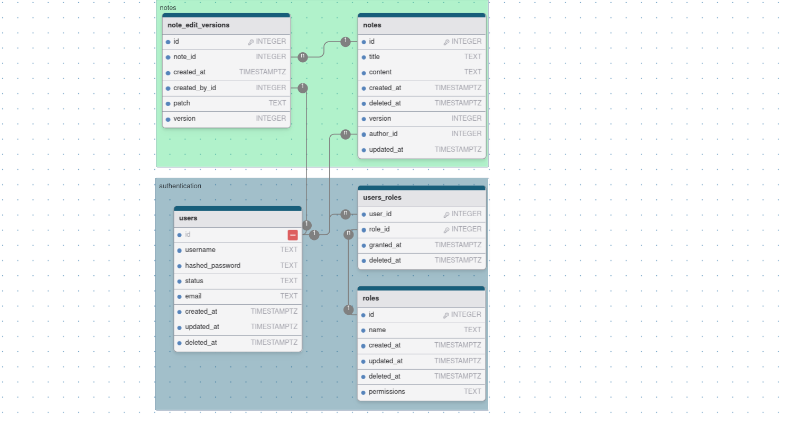

# Database design

This database schema and script are created with: https://drawdb.vercel.app

## Preview



## SQL script

```sql
CREATE TABLE "users" (
	"id" INTEGER NOT NULL UNIQUE,
	"username" TEXT,
	"hashed_password" TEXT,
	"status" TEXT DEFAULT 'inactive',
	"email" TEXT,
	"created_at" TIMESTAMP,
	"updated_at" TIMESTAMP,
	"deleted_at" TIMESTAMP,
	PRIMARY KEY("id")
);

CREATE INDEX "username_exact_index"
ON "users" ("username");

CREATE INDEX "users_index_1"
ON "users" ("username", "hashed_password");

CREATE TABLE "roles" (
	"id" INTEGER NOT NULL UNIQUE,
	"name" TEXT,
	"created_at" TIMESTAMP,
	"updated_at" TIMESTAMP DEFAULT NOW(),
	"deleted_at" TIMESTAMP,
	"permissions" TEXT ARRAY,
	PRIMARY KEY("id")
);

CREATE INDEX "roles_index_0"
ON "roles" ("created_at");

CREATE TABLE "users_roles" (
	"user_id" INTEGER NOT NULL UNIQUE,
	"role_id" INTEGER NOT NULL,
	"granted_at" TIMESTAMP,
	"deleted_at" TIMESTAMP,
	PRIMARY KEY("user_id", "role_id")
);


CREATE TABLE "notes" (
	"id" INTEGER NOT NULL UNIQUE,
	"title" TEXT,
	"content" TEXT,
	"created_at" TIMESTAMP,
	"deleted_at" TIMESTAMP,
	"version" INTEGER,
	"author_id" INTEGER,
	"updated_at" TIMESTAMP,
	PRIMARY KEY("id")
);


CREATE TABLE "note_edit_versions" (
	"id" INTEGER NOT NULL UNIQUE,
	"note_id" INTEGER,
	"created_at" TIMESTAMP,
	"created_by_id" INTEGER,
	"patch" TEXT,
	"version" INTEGER,
	PRIMARY KEY("id")
);


ALTER TABLE "users_roles"
ADD FOREIGN KEY("user_id") REFERENCES "users"("id")
ON UPDATE CASCADE ON DELETE CASCADE;
ALTER TABLE "users_roles"
ADD FOREIGN KEY("role_id") REFERENCES "roles"("id")
ON UPDATE CASCADE ON DELETE CASCADE;
ALTER TABLE "note_edit_versions"
ADD FOREIGN KEY("note_id") REFERENCES "notes"("id")
ON UPDATE CASCADE ON DELETE CASCADE;
ALTER TABLE "note_edit_versions"
ADD FOREIGN KEY("created_by_id") REFERENCES "users"("id")
ON UPDATE CASCADE ON DELETE CASCADE;
ALTER TABLE "notes"
ADD FOREIGN KEY("author_id") REFERENCES "users"("id")
ON UPDATE CASCADE ON DELETE CASCADE;

```